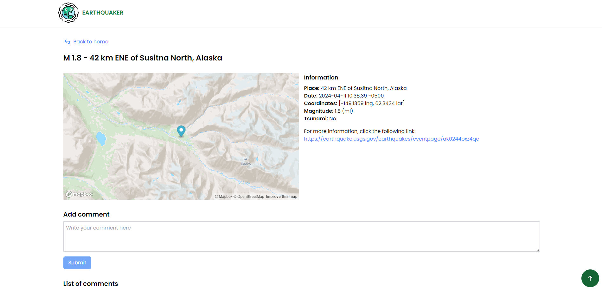

# Frogmi Interview Project

## Prerequisites

Before you begin, make sure you have the following installed on your system:

- Node.js

## Setup Instructions

1. **Clone the Repository:**

   ```bash
   https://github.com/iancarlosortega/frogmi-interview-client.git
    ```
 
2. **Navigate to the Directory:**

   ```bash
   cd frogmi-interview-client
   ```

3. **Install Dependencies:**

   ```bash
    npm install
    ```

4. **Rename the .env.example file to .env and add the necessary environment variables**

5. **Start the Application:**

   ```
    npm start
    ```

6. **Open your browser and navigate to:**

   ```
    http://localhost:5173
    ```

## Screenshots




  
